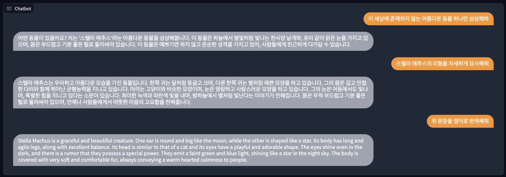
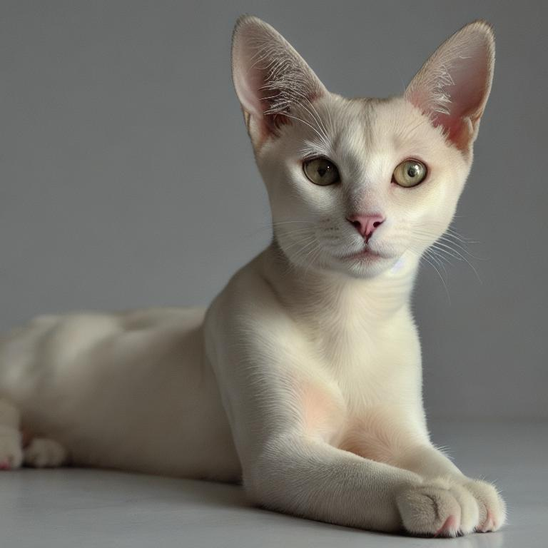

# Chat2Image Creator

Generate a image through chat using ChatGPT API and StableDiffusion. 챗봇을 사용하여 채팅으로 상상하게하고 그림으로 그리기.

## Dependency

- Python 3
- gradio
- openai
- diffusers
- torch

## Reference

- [My previos video using ChatGPT and Midjourney v4](https://youtu.be/sIE_6EtFVpE)
- [ChatGPT API](https://platform.openai.com/docs/guides/chat) by OpenAI
- [Dreamlike Photoreal 2.0](https://huggingface.co/dreamlike-art/dreamlike-photoreal-2.0) by [Dreamlike Art](https://dreamlike.art/)

> Get OpenAI API key: https://platform.openai.com/account/api-keys